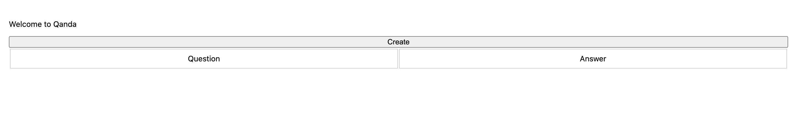

# [WIP] qanda
Simple Interface for self Q&amp;A
This is a simple interface storing Q&A which you want to answer for yourself. This is just a very simple way to store and retrieve from your local environment. I thought of buidling it after I subscribed to James Clear's [3-2-1](https://jamesclear.com/3-2-1) and thought how can I store everything locally.

## How does it work?
When you start the server it creates a local db file and creates a table at startup. If you kill your server and start later, it will just use the previously created db. If you want to start afresh, you just need to delete the db file and restart the server. 

## Steps
 - When you start the server, you will see a landing page shown below when you hit http://localhost:3000
    
    This page will list all your previous question and answers in tabular format

- Clicking create will take you to the create page as shown below
    
    Once you add questions and answers to it, you can click on submit to store it in DB.

- Once you click submit, it will take you back to homepage with latest data as shown below
    

## Why local?
- To store everything inhouse
- Learn Javascript to build simple interfaces